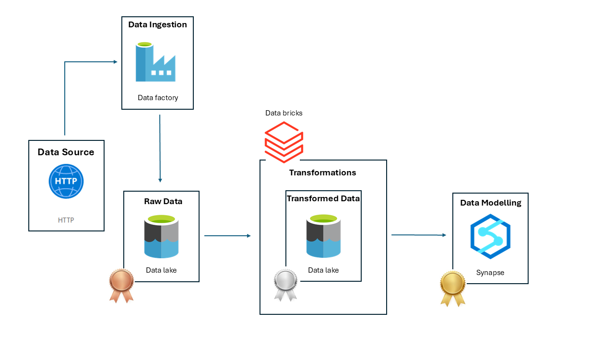

# Azure Movies Pipeline

## Architecture Overview

## Steps Implemented

### 1. Data Ingestion – Bronze Layer
- **Extracted** movie and rating datasets directly from GitHub using an **Azure Data Factory HTTP linked service**.
- **Loaded** the raw CSV files into **Azure Data Lake Storage Gen2** (Bronze layer) for durable, low-cost storage.

### 2. Data Transformation – Silver Layer
- **Developed PySpark notebooks in Azure Databricks** to clean and normalize the raw data:
  - Parsed release years from movie titles.
  - Split multi-genre strings into arrays/rows.
  - Converted Unix timestamps to human-readable datetime.
- **Wrote the transformed data back to ADLS Gen2** in Parquet format (Silver layer).

### 3. Data Modeling – Gold Layer
- **Created external tables and views in Azure Synapse Analytics** over the Silver layer to enable serverless SQL querying.
- **Exposed curated tables in the Gold layer** of the data lake for downstream analytics.

